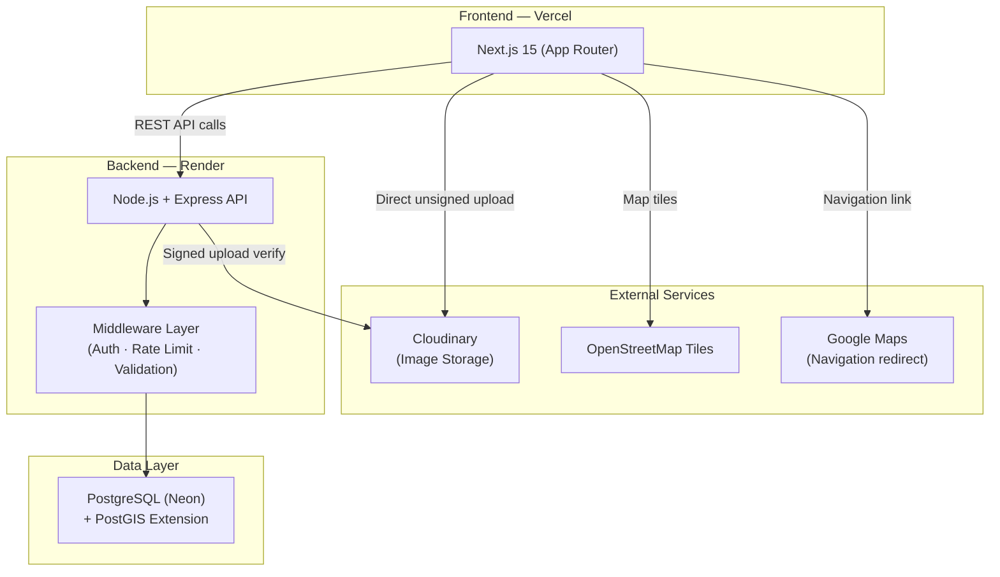
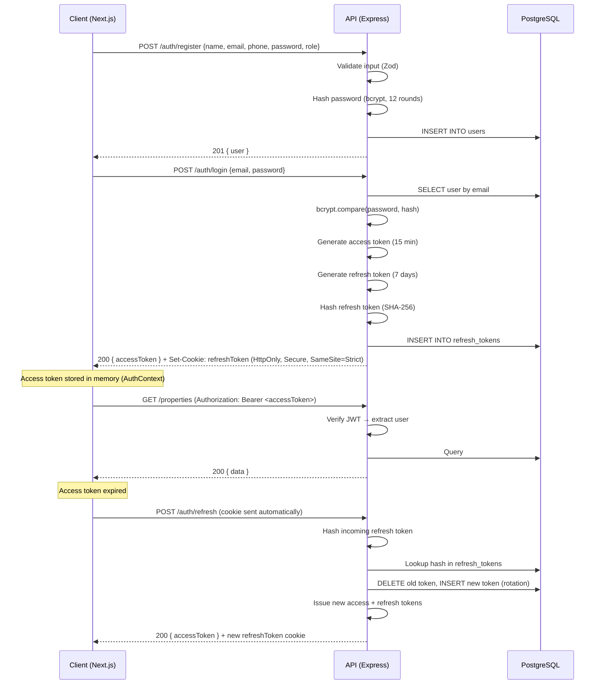
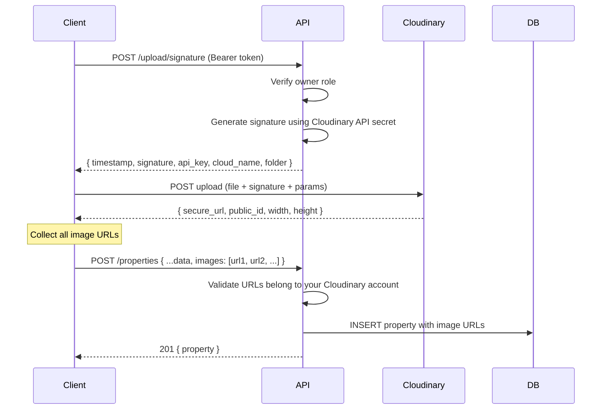
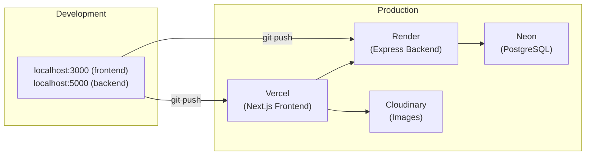

# Apna Stay — Implementation Plan

> Production-grade, location-based property rental platform MVP targeting 10K+ users.

---

## 1. System Architecture Overview



**Key decisions:**
- **Monolithic backend** — single Express server. No microservices; unnecessary at 10K users.
- **Signed uploads via backend** — frontend gets a signature from backend, uploads directly to Cloudinary. Prevents abuse while avoiding backend bandwidth bottleneck.
- **PostGIS** for geo queries — industry-standard, supported natively by Neon.
- **Neon's built-in PgBouncer** — use the pooled connection string to handle connection limits efficiently.

---

## 2. Folder Structure

### Frontend (`/frontend`)

```
frontend/
├── public/
│   └── favicon.ico
├── src/
│   ├── app/
│   │   ├── layout.tsx              # Root layout (fonts, metadata, providers)
│   │   ├── page.tsx                # Landing page (geo-detected)
│   │   ├── properties/
│   │   │   ├── page.tsx            # Search/filter + map view
│   │   │   └── [id]/
│   │   │       └── page.tsx        # Property detail page
│   │   ├── auth/
│   │   │   ├── login/page.tsx
│   │   │   └── register/page.tsx
│   │   ├── dashboard/
│   │   │   ├── layout.tsx          # Protected layout (owner/admin)
│   │   │   ├── page.tsx            # Dashboard home
│   │   │   ├── properties/
│   │   │   │   ├── page.tsx        # My listings
│   │   │   │   ├── new/page.tsx    # Add property
│   │   │   │   └── [id]/edit/page.tsx
│   │   │   └── admin/
│   │   │       ├── users/page.tsx
│   │   │       └── properties/page.tsx
│   │   └── not-found.tsx
│   ├── components/
│   │   ├── ui/                     # Reusable primitives (Button, Input, Card, Modal)
│   │   ├── layout/                 # Header, Footer, Sidebar
│   │   ├── map/
│   │   │   ├── MapView.tsx         # Leaflet map wrapper (client component)
│   │   │   ├── PropertyMarker.tsx
│   │   │   └── MapSkeleton.tsx
│   │   ├── property/
│   │   │   ├── PropertyCard.tsx
│   │   │   ├── PropertyGrid.tsx
│   │   │   ├── PropertyFilters.tsx
│   │   │   └── ImageGallery.tsx
│   │   └── upload/
│   │       └── ImageUploader.tsx   # Cloudinary upload widget
│   ├── lib/
│   │   ├── api.ts                  # Axios/fetch wrapper with interceptors
│   │   ├── auth.ts                 # Token management helpers
│   │   ├── cloudinary.ts           # Upload signature helpers
│   │   └── geo.ts                  # Browser geolocation helper
│   ├── hooks/
│   │   ├── useAuth.ts
│   │   ├── useGeolocation.ts
│   │   └── useProperties.ts
│   ├── context/
│   │   └── AuthContext.tsx
│   ├── types/
│   │   └── index.ts                # Shared TypeScript interfaces
│   └── styles/
│       └── globals.css
├── next.config.ts
├── tailwind.config.ts
├── tsconfig.json
└── package.json
```

### Backend (`/backend`)

```
backend/
├── src/
│   ├── index.ts                    # Entry point — app bootstrap
│   ├── app.ts                      # Express app setup (middleware, routes)
│   ├── config/
│   │   ├── db.ts                   # pg Pool singleton (Neon pooled string)
│   │   ├── env.ts                  # Environment variable validation
│   │   └── cloudinary.ts           # Cloudinary SDK config
│   ├── middleware/
│   │   ├── auth.ts                 # JWT verification + role extraction
│   │   ├── authorize.ts            # Role-based access control
│   │   ├── validate.ts             # Request validation (Zod)
│   │   ├── rateLimiter.ts          # express-rate-limit config
│   │   └── errorHandler.ts         # Global error handler
│   ├── routes/
│   │   ├── auth.routes.ts
│   │   ├── property.routes.ts
│   │   ├── upload.routes.ts
│   │   └── admin.routes.ts
│   ├── controllers/
│   │   ├── auth.controller.ts
│   │   ├── property.controller.ts
│   │   ├── upload.controller.ts
│   │   └── admin.controller.ts
│   ├── services/
│   │   ├── auth.service.ts         # Business logic for auth
│   │   ├── property.service.ts     # Business logic for properties
│   │   └── admin.service.ts
│   ├── repositories/
│   │   ├── user.repository.ts      # SQL queries for users
│   │   └── property.repository.ts  # SQL queries for properties (inc. geo)
│   ├── validators/
│   │   ├── auth.validator.ts       # Zod schemas for auth payloads
│   │   └── property.validator.ts   # Zod schemas for property payloads
│   ├── utils/
│   │   ├── jwt.ts                  # Sign/verify helpers
│   │   ├── password.ts             # bcrypt hash/compare
│   │   └── response.ts            # Standardized API response formatter
│   └── types/
│       └── index.ts
├── migrations/
│   ├── 001_enable_postgis.sql
│   ├── 002_create_users.sql
│   ├── 003_create_properties.sql
│   └── 004_create_refresh_tokens.sql
├── tsconfig.json
├── .env.example
└── package.json
```

---

## 3. Database Schema (PostgreSQL + PostGIS)

### Enable PostGIS

```sql
-- migrations/001_enable_postgis.sql
CREATE EXTENSION IF NOT EXISTS postgis;
CREATE EXTENSION IF NOT EXISTS "uuid-ossp";
```

### Users Table

```sql
-- migrations/002_create_users.sql
CREATE TYPE user_role AS ENUM ('user', 'owner', 'admin');

CREATE TABLE users (
    id          UUID PRIMARY KEY DEFAULT uuid_generate_v4(),
    name        VARCHAR(100)  NOT NULL,
    email       VARCHAR(255)  NOT NULL UNIQUE,
    phone       VARCHAR(15)   NOT NULL,
    password    VARCHAR(255)  NOT NULL,  -- bcrypt hash
    role        user_role     NOT NULL DEFAULT 'user',
    is_active   BOOLEAN       NOT NULL DEFAULT true,
    created_at  TIMESTAMPTZ   NOT NULL DEFAULT NOW(),
    updated_at  TIMESTAMPTZ   NOT NULL DEFAULT NOW()
);

CREATE INDEX idx_users_email ON users (email);
CREATE INDEX idx_users_role  ON users (role);
```

### Properties Table

```sql
-- migrations/003_create_properties.sql
CREATE TYPE property_type   AS ENUM ('apartment', 'house', 'villa', 'pg', 'hostel', 'commercial');
CREATE TYPE listing_status  AS ENUM ('pending', 'approved', 'rejected');
CREATE TYPE listing_purpose AS ENUM ('rent', 'sale');

CREATE TABLE properties (
    id              UUID PRIMARY KEY DEFAULT uuid_generate_v4(),
    owner_id        UUID           NOT NULL REFERENCES users(id) ON DELETE CASCADE,
    title           VARCHAR(200)   NOT NULL,
    description     TEXT           NOT NULL,
    property_type   property_type  NOT NULL,
    purpose         listing_purpose NOT NULL DEFAULT 'rent',
    price           NUMERIC(12,2)  NOT NULL CHECK (price > 0),
    address         TEXT           NOT NULL,
    city            VARCHAR(100)   NOT NULL,
    state           VARCHAR(100)   NOT NULL,
    pincode         VARCHAR(10)    NOT NULL,
    location        GEOGRAPHY(Point, 4326) NOT NULL,  -- PostGIS point (lng, lat)
    bedrooms        SMALLINT,
    bathrooms       SMALLINT,
    area_sqft       INTEGER,
    amenities       TEXT[]         DEFAULT '{}',
    images          TEXT[]         NOT NULL DEFAULT '{}',  -- Cloudinary URLs
    status          listing_status NOT NULL DEFAULT 'pending',
    is_available    BOOLEAN        NOT NULL DEFAULT true,
    created_at      TIMESTAMPTZ    NOT NULL DEFAULT NOW(),
    updated_at      TIMESTAMPTZ    NOT NULL DEFAULT NOW()
);

-- Critical indexes
CREATE INDEX idx_properties_location ON properties USING GIST (location);
CREATE INDEX idx_properties_owner    ON properties (owner_id);
CREATE INDEX idx_properties_status   ON properties (status);
CREATE INDEX idx_properties_city     ON properties (city);
CREATE INDEX idx_properties_price    ON properties (price);
CREATE INDEX idx_properties_type     ON properties (property_type);

-- Composite index for common filter combo
CREATE INDEX idx_properties_city_type_price ON properties (city, property_type, price)
    WHERE status = 'approved' AND is_available = true;
```

### Refresh Tokens Table

```sql
-- migrations/004_create_refresh_tokens.sql
CREATE TABLE refresh_tokens (
    id          UUID PRIMARY KEY DEFAULT uuid_generate_v4(),
    user_id     UUID         NOT NULL REFERENCES users(id) ON DELETE CASCADE,
    token_hash  VARCHAR(255) NOT NULL,  -- SHA-256 hash of the token
    expires_at  TIMESTAMPTZ  NOT NULL,
    created_at  TIMESTAMPTZ  NOT NULL DEFAULT NOW()
);

CREATE INDEX idx_refresh_tokens_user ON refresh_tokens (user_id);
CREATE INDEX idx_refresh_tokens_hash ON refresh_tokens (token_hash);
```

> [!IMPORTANT]
> The `location` column uses `GEOGRAPHY(Point, 4326)` — distances are calculated in **meters** and `ST_DWithin` queries leverage the **GiST index** automatically for fast radius searches.

---

## 4. API Design

### Auth Routes (`/api/auth`)

| Method | Endpoint | Auth | Description |
|--------|----------|------|-------------|
| POST | `/api/auth/register` | — | Register new user/owner |
| POST | `/api/auth/login` | — | Login, returns access + refresh tokens |
| POST | `/api/auth/refresh` | Cookie | Rotate refresh token, issue new access token |
| POST | `/api/auth/logout` | Bearer | Invalidate refresh token |
| GET  | `/api/auth/me` | Bearer | Get current user profile |

### Property Routes (`/api/properties`)

| Method | Endpoint | Auth | Description |
|--------|----------|------|-------------|
| GET | `/api/properties` | — | List approved properties (paginated, filtered) |
| GET | `/api/properties/nearby` | — | Geo query: `?lat=X&lng=Y&radius=5000` |
| GET | `/api/properties/:id` | — | Single property detail |
| POST | `/api/properties` | Owner | Create new listing |
| PUT | `/api/properties/:id` | Owner | Update own listing |
| DELETE | `/api/properties/:id` | Owner | Delete own listing |

**Query params for GET `/api/properties`:**
`?city=&type=&minPrice=&maxPrice=&purpose=&page=1&limit=20&sort=price_asc`

**Query params for GET `/api/properties/nearby`:**
`?lat=28.6139&lng=77.2090&radius=5000&type=&minPrice=&maxPrice=&page=1&limit=20`

### Upload Routes (`/api/upload`)

| Method | Endpoint | Auth | Description |
|--------|----------|------|-------------|
| POST | `/api/upload/signature` | Owner | Generate Cloudinary signed upload params |

### Admin Routes (`/api/admin`)

| Method | Endpoint | Auth | Description |
|--------|----------|------|-------------|
| GET | `/api/admin/users` | Admin | List all users (paginated) |
| GET | `/api/admin/properties` | Admin | List all properties (any status, paginated) |
| PATCH | `/api/admin/properties/:id/status` | Admin | Approve/reject listing |
| DELETE | `/api/admin/properties/:id` | Admin | Force-delete listing |

**Standardized response format:**

```json
{
  "success": true,
  "data": { ... },
  "meta": { "page": 1, "limit": 20, "total": 142 },
  "error": null
}
```

---

## 5. Authentication Flow



**Key implementation details:**
- Access token: **15 min** expiry, stored in **memory** (React context/variable)
- Refresh token: **7 days** expiry, stored in **HttpOnly Secure cookie**
- Refresh token **rotation** on every use — old token invalidated, new one issued
- `bcrypt` with **12 salt rounds**
- JWT payload: `{ userId, role, iat, exp }`

---

## 6. Image Upload Flow



**Why signed uploads (not unsigned):**
- Prevents anyone from uploading to your Cloudinary account
- Backend controls the folder, transformation presets, and max file size
- Upload still happens directly client → Cloudinary (no backend bandwidth)

**Cloudinary config:**
- Folder structure: `apna-stay/properties/{owner_id}/`
- Allowed formats: `jpg, png, webp`
- Max file size: `5MB`
- Auto-transformation: resize to max `1200px` width, quality `auto`
- Max images per property: **10**

---

## 7. Map & Geolocation Handling

### Browser Geolocation (Landing Page)

```
1. Page loads → call navigator.geolocation.getCurrentPosition()
2. If granted → store { lat, lng } in state → fetch /api/properties/nearby
3. If denied  → fallback to IP-based city detection OR show city selector
4. User can manually change location via search bar
```

### Leaflet Map Integration

- Use `react-leaflet` with `next/dynamic` (`ssr: false`) to avoid SSR errors
- Install `leaflet-defaulticon-compatibility` for marker icon resolution
- Map component receives `properties[]` as props, renders markers
- Clustering via `react-leaflet-markercluster` when marker count > 50

### Radius Query (Backend)

```sql
-- property.repository.ts — findNearby()
SELECT
    id, title, price, property_type, address, city,
    images[1] AS thumbnail,
    ST_Distance(location, ST_MakePoint($1, $2)::geography) AS distance_meters
FROM properties
WHERE status = 'approved'
  AND is_available = true
  AND ST_DWithin(location, ST_MakePoint($1, $2)::geography, $3)
ORDER BY distance_meters ASC
LIMIT $4 OFFSET $5;

-- $1 = longitude, $2 = latitude, $3 = radius in meters, $4 = limit, $5 = offset
```

> [!WARNING]
> `ST_MakePoint` takes **(longitude, latitude)** — not (lat, lng). The browser geolocation API returns `(latitude, longitude)`. Swap the values before passing to the query.

### Google Maps Navigation

```
// Simple redirect link — no API key needed
const googleMapsUrl = `https://www.google.com/maps/dir/?api=1&destination=${lat},${lng}`;
window.open(googleMapsUrl, '_blank');
```

---

## 8. Scalability Strategy (10K Users)

### Database

| Strategy | Implementation |
|----------|---------------|
| **Connection pooling** | Use Neon's pooled connection string (`-pooler` hostname). App-side `pg.Pool` with `max: 10`, `idleTimeoutMillis: 30000`, `connectionTimeoutMillis: 5000` |
| **GiST spatial index** | On `properties.location` — ensures `ST_DWithin` uses index scan, not seq scan |
| **Composite indexes** | On `(city, property_type, price)` filtered by `status='approved'` |
| **Cursor-based pagination** | Primary lists use `LIMIT/OFFSET` (fine for 10K). Switch to cursor-based if needed later |

### API Layer

| Strategy | Implementation |
|----------|---------------|
| **Rate limiting** | `express-rate-limit`: 100 req/min general, 10 req/min for auth endpoints |
| **Response compression** | `compression` middleware for all responses |
| **Pagination** | All list endpoints enforce `limit` (default 20, max 50) |
| **Field selection** | List endpoints return minimal fields; detail endpoints return full object |

### Frontend

| Strategy | Implementation |
|----------|---------------|
| **SSR/SSG** | Property detail pages use ISR (revalidate 60s). Search pages use client-side fetching |
| **Image optimization** | Cloudinary transformations (auto format, auto quality, responsive widths) |
| **Map lazy loading** | Map component loaded only when in viewport |
| **Bundle splitting** | Next.js automatic code splitting per route |

### Caching (Phase 1 — Simple)

- **HTTP Cache-Control** headers for public property data (`max-age=60`)
- **Cloudinary CDN** for all images (built-in)
- **No Redis required** at 10K users — add in Phase 2 if needed

---

## 9. Deployment Plan



### Environment Variables

**Backend (Render):**
```
DATABASE_URL=postgresql://...@...neon.tech/apnastay?sslmode=require
JWT_ACCESS_SECRET=<random-64-char>
JWT_REFRESH_SECRET=<random-64-char>
CLOUDINARY_CLOUD_NAME=...
CLOUDINARY_API_KEY=...
CLOUDINARY_API_SECRET=...
CORS_ORIGIN=https://apnastay.vercel.app
NODE_ENV=production
PORT=5000
```

**Frontend (Vercel):**
```
NEXT_PUBLIC_API_URL=https://apnastay-api.onrender.com/api
NEXT_PUBLIC_CLOUDINARY_CLOUD_NAME=...
NEXT_PUBLIC_CLOUDINARY_API_KEY=...
```

### Deployment Checklist

- [ ] Run migrations on Neon (`psql < migrations/*.sql` in order)
- [ ] Set all env vars on Render and Vercel
- [ ] Configure CORS on backend to allow only the Vercel domain
- [ ] Enable Render auto-deploy from `main` branch
- [ ] Enable Vercel auto-deploy from `main` branch
- [ ] Verify health endpoint: `GET /api/health`
- [ ] Test auth flow end-to-end
- [ ] Test property creation with image upload
- [ ] Test nearby search with real coordinates

---

## 10. Security Checklist

| Threat | Mitigation |
|--------|-----------|
| SQL Injection | Parameterized queries only (`$1, $2`) — never string concatenation |
| XSS | React auto-escapes. Sanitize user HTML input with `DOMPurify` on display |
| CSRF | SameSite=Strict cookies. No cookie-based auth for mutations |
| Brute Force | Rate limiting on `/auth/login` (10 req/min per IP) |
| Token Theft | Short-lived access tokens (15 min). Refresh token rotation |
| File Upload Abuse | Signed uploads. Backend validates file type/size. Cloudinary moderation |
| Data Exposure | Never return password hash. Select only needed columns |
| CORS | Strict origin whitelist — only your Vercel domain |

---

## 11. Future Upgrade Path (Phase 2)

| Feature | Details |
|---------|---------|
| **Saved/Favorites** | Users can save properties. New `favorites` junction table |
| **Reviews & Ratings** | Users rate properties post-visit. New `reviews` table |
| **Email Notifications** | Listing approved/rejected alerts via Resend or SendGrid |
| **Advanced Search** | Full-text search with `tsvector` + `GIN` index on title/description |
| **Redis Caching** | Cache popular city queries, property counts. Upstash Redis |
| **Push Notifications** | New listings in your area (Web Push API) |
| **Payment Integration** | Premium listings, featured properties (Razorpay) |
| **Analytics Dashboard** | Owner: views/contacts per listing. Admin: platform metrics |
| **Image Moderation** | Cloudinary AI moderation add-on for auto-flagging |
| **PWA** | Offline-capable, installable on mobile |

---

## Open Questions

> [!IMPORTANT]
> **Neon Tier:** The free tier has 0.5 GB storage and cold starts (~300-500ms). For 10K users with property images stored as URLs (not blobs), storage should be fine for MVP. But cold starts may affect UX. Are you planning to use the free tier or a paid Neon plan?

> [!IMPORTANT]
> **Admin Seeding:** The first admin user needs to be created manually via a migration or seed script (no public admin registration). Confirm: should admin creation be migration-only, or do you want a CLI command?

> [!NOTE]
> **WhatsApp Contact:** The "Contact Owner via WhatsApp" feature will use `https://wa.me/{phone}` deep links — no WhatsApp Business API needed for MVP. The owner's phone number will be visible on the property detail page. Confirm this is acceptable from a privacy standpoint.
